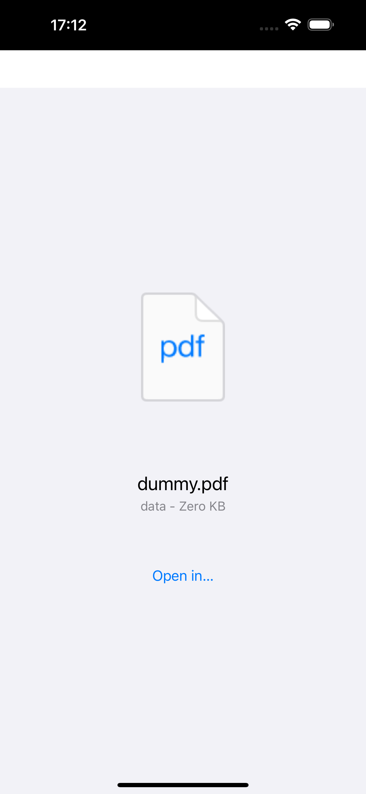

## Purpose

This is a minimal reproduction to demonstrate iOS 18.4 Web App behavior for file downloads.

Requires:

- a local PHP installation
- XCode Simulator with an iPhone 18.4 virtual device

## Description of the bug

When installed as a Web App on the user's home screen, any file download (i.e. `<a href="myfile.pdf" download>` together with a `Content-disposition: attachment` header) will result in an “Open in …” splash screen that prohibits further navigation inside the Web App. The only resolution is to force-close and relaunch the web app.

Related: When the file is displayed inline (e.g. if served without `Content-Disposition: attachment`), the file preview also prevents any further navigation inside the PWA. It even prevents saving the file outside the PWA.

## Steps to reproduce

1. Clone the repository
2. Open a terminal in the repository root directory
3. Run your local php server with `php -S localhost:8080`
4. Open Simulator and start a virtual iPhone iOS 18.4 device (device model does not matter)
5. Open Safari in the simulator device
6. Navigate to `http://localhost:8080`
7. Tap the “Download PDF with Content-Disposition: attachment” link
8. An iOS-native file download dialog should appear, asking if you want to download “dummy.pdf”
9. Abort or approve the download
10. Add the website as a Web App: Tap the Share icon, then “Add to Homescreen”, then “Add”
11. Open the installed Web App “PWA Bug”
12. Tap “Download PDF with Content-Disposition: attachment” link inside the PWA
13. See error: Instead of a file download like in Safari, there's only a full-size file icon with “Open in …”, no way to return to the PWA.

Related bug:

## Expected behavior

The file download should trigger the same permission dialog like in mobile Safari, and then present a system file picker where the Downloads directory is preselected.

## Actual behavior

The file download renders a iOS-native file type icon with metadata and “Open in …”, but no way to navigate back to the PWA:

The inline display renders the file, but also has no way to navigate back or store the file outside the PWA:

